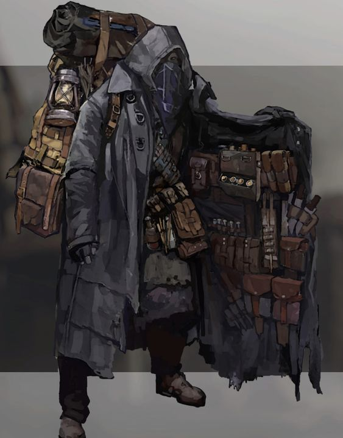
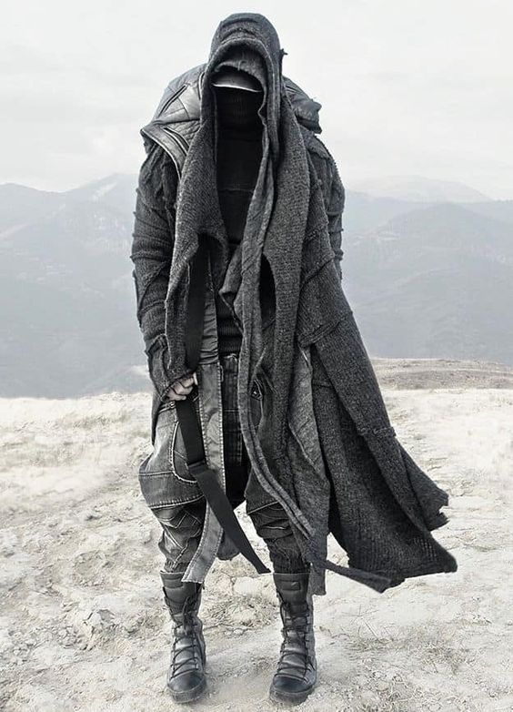

## Анкета
0.0 Игрок: gohellp  

---

1.1 Имя персонажа: Дерек Эрнест  
1.2 Прозвище:   
1.3 Раса персонажа и ее подвид: Гоблин / Полурослик  

---

2.1 Возраст: 26 лет  
2.2 Пол: М  
2.3 Рост: 167 см  
2.4 Вес: 40 кг  
2.5 Телосложение: средне-худощавое  

---

3.1 Травмы:  (Пункт не обязателен к заполнению)  
3.2 Болезни:   
3.3 Страхи:  Лёгкий страх чужих повреждений, Акрофобия, лёгкая степень Коинофобии  

---

3.4 Предпочтения: Механизмы и Исследования  
3.5 Привычки:  минимум 2  
3.6 Принципы: Честность, Добродетель, Принципиальность минимум 3  
3.7 Вероисповедание: Атеизм(?)  

---

4.1 Навыки и Перки: (Оставляйте пустым до проверки анкетологов, вам выдадут очки, которые можно тратить на "прокачку навыков с курса 1 очко = 1 уровень навыка, но не выше Ветерана, очки выдаются за качество анкеты). Очки за анкету должны быть не меньше 7-и, но и не больше девяти, где 7 - минимум, а 12  - максимум. Во время регистрации анкеты, очки не тратятся на уровень навыка "Ученика", а начинают эту трату лишь с "Новичок".)  
4.2 Баффы:   

- Глаз-алмаз (-20)
- Стальная спина (-15)
- Быстрое лечение (-25)
- Свинцовый живот (-30)
- Двухсторонняя монета (-20)
- Иммунный (-30)
- Длинные пальцы (-10)
- Ясное сознание (-30)
- Нестандартное мышление (-15)
- Конструктивное мышление (-15)
- Быстрое обучение (-25)
- Доброта (-10)
- Бывший Кочевник (-10)

Далее идут баффы, что не влезают в рассчитанный минимум:

- Проницательный / Умный / Гениальный ( Выбрать, точно ) ( -25 / -50 / -75 )
- __Атеист__ ( -30 )
- Амбидекстрия ( не уверен ) ( -20 )
- Грамотный / Образованный ( Выбрать, точно ) ( -20 / -50 )
- Фантазер ( вообще хз ) ( -20 )
- __Непоколебимый__ ( -20 )
- Аскет (маловероятно) ( -50 )
- __Трудоголик__ ( -35 )
- Если не мы, то кто? ( не уверен ) ( -40 )
- Всеядность ( не уверен ) ( -15 )
- __Сталкер__ ( -15 )
- __Скромность__ ( -15 )
- Страшный человек ( уточнить, не уверен ) ( -20 )
- Мастер-торговец ( под вопросом ) ( -35 )
- Лекарь души ( не уверен ) ( -5 )
- __Ваятель науки__ ( -10 )
- Неопределившийся ( под вопросом ) ( -30 )
- Эмпатия ( под вопросом ) ( -35 )
- Торговец-самоучка ( не уверен ) ( -30 )
- __Смотритель маяка__ ( -20 )
- Потомок капибар ( __Спросить про обратное__ )
- __Грузовая площадка__ ( -5 )
- Отмычка на черный день ( под вопросом ) ( -15 )
- __Незаметный__ ( -20 )
- Шестое чувство ( по возможности ) ( -45 )
- Пылесос / Мародёр ( по возможности, выбрать ) ( -15 / -25 )

минимум обязательных: 215

4.3 Дебаффы:

- Хороший сон (+5) 
- Худой (+5)
- Кожная фоточувствительность (+25)
- ! Эпилепсия (???) (+70)
- ! Синдром чужой руки (запросить или уточнить через Раздвоение личности) ( ?|+60 ) 
- Топографический кретинизм (+60)
- Прочерк в памяти (+60)
- Правильный парень (+10)
- Пацифист (+30)
- Мыслитель (+5)
- Плохой сон (+5)
- Плохое чувство юмора (+5)
- Стеснительный (+15)
- ! Человек с памятки (уточнить) (+55)
- ! Душнила (под вопросом) (+25)
- Неорганизованный (+25)
- Чаеман (+5)
- ! Ай, бля! (под вопросом) (+30)

Итого: минимум 255

---

5.1 Характер: см. ХАРАКТЕР

---

6.1  Магия: (Не выше первого порядка )  
6.2 Вид мага: __Цейтнот__ / Плюар, Тип: ~~Верум~~ / _Клериос_ / Телекинез / _Аирвара_  
( эти 2 пункта буду выбирать случайностью, скорее всего )

---

Биография: см. БИОГРАФИЯ минимум 3к символов

---

Инвентарь: 

---

Внешность (Описание): см. ВНЕШНОСТЬ

## Дополнительная информация:
### ВНЕШНОСТЬ:

    

        <h3>Гоблин:</h3>
       
    

    

        <h3>Полурослик:</h3>
        
    

### ХАРАКТЕР:
Дерек изначально не будет участвовать в беседе с незнакомыми ему людьми,
изучая их и пытаясь ответить себе на вопрос "Стоит ли оно того?".
В случае положительного же ответа, он будет почти полностью подстраиваться под собеседника и частично копировать его повадки.
Если же собеседник будет жаловаться на какую-либо проблему, то Дерек попробует найти решение оной и тут же предложит его.

### БИОГРАФИЯ:
Государство пребывания: Кадия( Гоблин, Полурослик )

(Так ничего и не пришло в голову)

    

        <h3>Гоблин:</h3>
    

    

        <h3>Полурослик:</h3>
    

### Музыкальная тема персонажа:
[Asper X - Локус Генома](https://music.youtube.com/watch?v=8KtlGzJrZek&si=aGeotXgGfEnPwKmv)  
[DEEP-EX-SENSE & ЛЖЕДМИТРИЙ IV - Бекап](https://music.youtube.com/watch?v=zTYHpSMvDXk&si=BYlpZDeB--t2uBcE)  
[ТЕППО - Голоса](https://music.youtube.com/watch?v=I7qPshAirz0&si=a97dXYKlb-v7guZS)  
[DEEP-EX-SENCE - Метастазы](https://music.youtube.com/watch?v=_8K4XpNbxr4&si=vFy52ntPWXz-V6Ux)  
[JT Machinima - Shadow Of Myself](https://music.youtube.com/watch?v=fSKF5glpf2Q&si=VHV1D73_IdW9euaM)  
[NF - Whe I Grow Up](https://music.youtube.com/watch?v=lxRwEPvL-mQ&si=4bzz4pJGjDSIU8GI)  
[NF - Change](https://music.youtube.com/watch?v=WTBKTPFJARw&si=c77MaCvwZ2FAIlUU)  
[Gorillaz - Saturnz Barz](https://music.youtube.com/watch?v=eCxjpGhorPs&si=tn79RNllQeWSdHzp)  
[SWARM - Savior](https://music.youtube.com/watch?v=Faj5euW1yVc&si=yCsj3cDH0X1ckjMt)  
